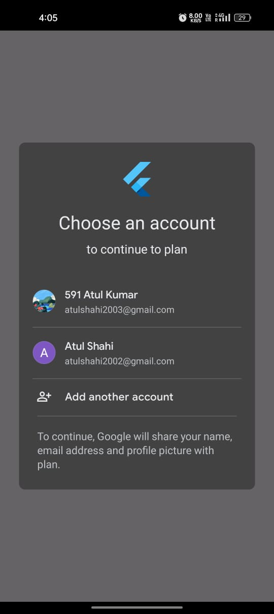
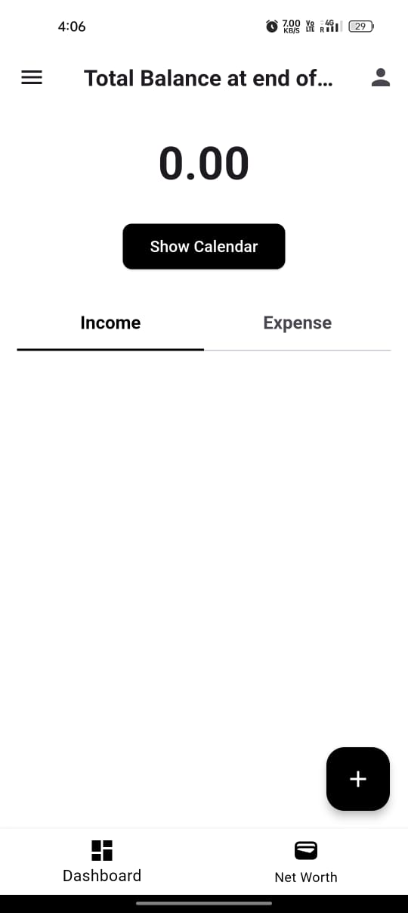
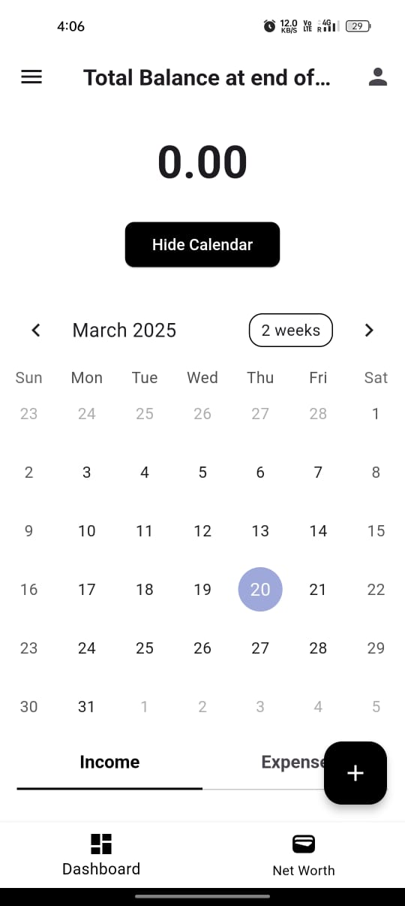
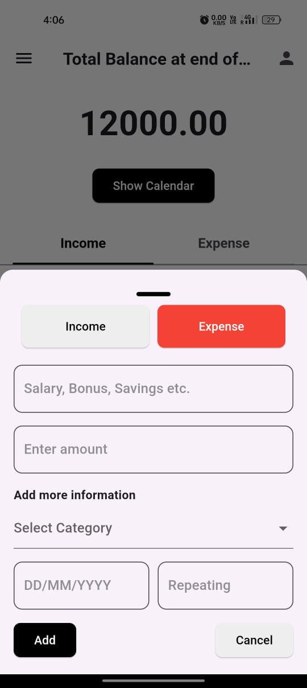
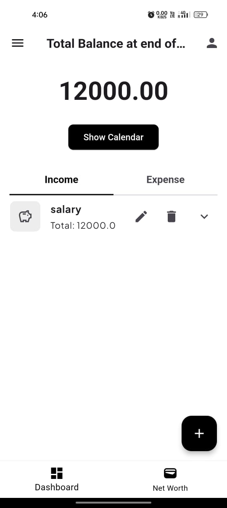
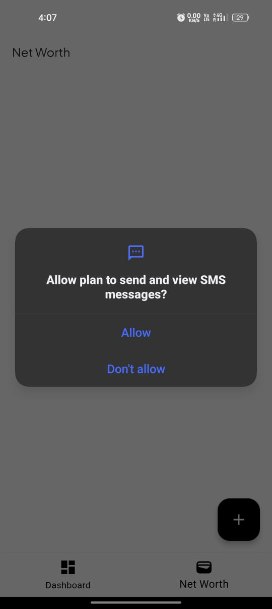
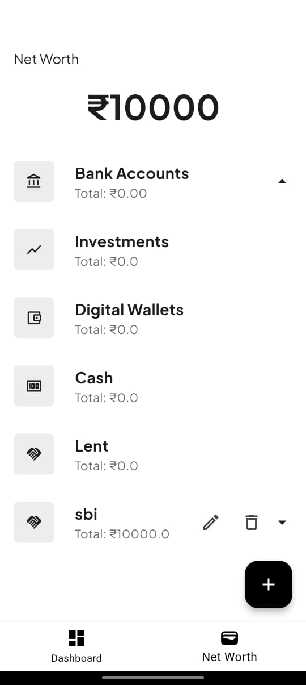

# Plan

Plan App

This Flutter app is designed to help users efficiently manage their financial transactions, including income and expenses. It features a user-friendly interface with intuitive navigation and multiple functionalities to track and organize finances.

## Features

### Dashboard Page
- **Add Income/Expense:** Users can add new income or expense entries by filling in details such as:
  - Description (e.g., Salary, Bonus, Savings, etc.)
  - Amount
  - Date (via a calendar picker)
  - Category selection for better organization
- **Edit/Delete Entries:** Each entry can be edited or deleted easily.
- **Total Balance Display:** Displays the calculated total balance based on all income and expenses.

### Net Worth Page
- **Net Worth Calculation:** Displays the total net worth based on various accounts and financial categories.
- **Message Scanning:** Requests user permission to read messages and converts scanned messages into JSON format.
  - In future updates, this data can be processed using AI to extract relevant transaction details for better tracking.
- **Add Categories & Accounts:** Users can:
  - Create custom financial categories (e.g., Bank Accounts, Investments, Digital Wallets, etc.)
  - Add specific accounts within these categories to track amounts effectively.
- **Predefined Categories:** Includes categories such as:
  - Bank Accounts
  - Investments
  - Digital Wallets
  - Cash
  - Lent
 
## Screenshot
- Here are some screenshots for representation of the application:














## Video Demonstration
For a better understanding of the app's functionality, watch the demo video:

[](images/video.gif)

## Navigation
- **Dashboard Tab:** For tracking income and expenses.
- **Net Worth Tab:** For managing categories, accounts, and tracking net worth.

## Future Plans
- Implement AI-based analysis of scanned messages to extract key financial details automatically.
- Introduce advanced filters and search features for better transaction management.

## Tech Stack
- **Flutter** (Framework)
- **Dart** (Programming Language)
- **flutter secure storage** (Local Storage)
- **Google sign In** (Online for sign-in purpose)
- **Flutter sms Inbox** (for tracking down the SMS)

## Installation
1. Clone the repository:
   ```bash
   git clone <repository-url>
   ```
2. Install dependencies:
   ```bash
   flutter pub get
   ```
3. Run the application:
   ```bash
   flutter run
   ```

## Permissions
- **Read Messages Permission:** Used to scan and convert financial messages to JSON format for future AI-driven insights.

## Contributions
Contributions are welcome! Feel free to submit issues and pull requests.
